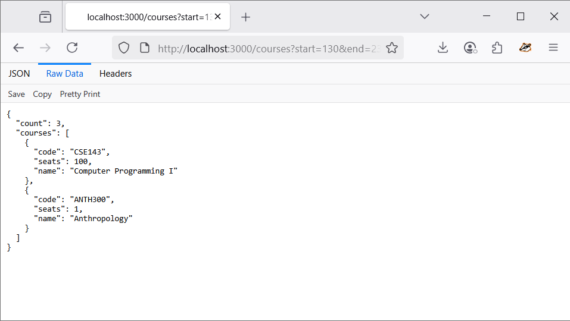

# Node Courses API

A simple Node.js REST API for retrieving course information from a MySQL database.

## Features

- Fetch courses by start and end time
- Shows available seats for each course
- Built with [Express](https://expressjs.com/) and [MySQL2](https://www.npmjs.com/package/mysql2)

## Getting Started

### Prerequisites

- [Node.js](https://nodejs.org/) installed
- [MySQL](https://www.mysql.com/) server running with a `courses` table

### Installation

1. Clone the repository:

    ```sh
    git clone https://github.com/serikalisack/node-courses-api.git
    cd node-courses-api
    ```

2. Install dependencies:

    ```sh
    npm install
    ```

3. Edit MySQL credentials in [`courses.js`](d:/test/courses.js):

    ```js
    // ...existing code...
    const pool = mysql.createPool({
      host: 'localhost_here',
      user: 'user_here',
      password: 'password_here',
      database: 'dbName_db'
    });
    // ...existing code...
    ```

4. Start the server:

    ```sh
    node courses.js
    ```

### Usage

Send a GET request to:

```
http://localhost:3000/courses?start=130&end=230
```

#### Example Output

```json
{
  "count": 2,
  "courses": [
    {
      "code": "CS101",
      "seats": 5,
      "name": "Intro to Computer Science"
    },
    {
      "code": "MATH201",
      "seats": 2,
      "name": "Calculus I"
    }
  ]
}
```

#### Screenshot



## About Me

**Serikalisack**  
Passionate backend developer with experience in Node.js and MySQL.  
[GitHub](https://github.com/serikalisack)  

## License

This project is licensed under the ISC License.

---

> For any questions or suggestions, feel free to contact me!